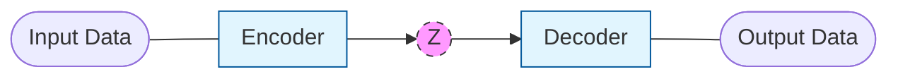

---
tags:
  - ml/architecture
  - ml
created: 2026-03-27 22:02
updated: 2026-03-27 22:02
featured_image: imgs/latent_scatter.png
thumbnail: imgs/resized/e2dadc95f6b658c9180b45dab6df92a4_86cf658e.webp
---
---

At their core, autoencoders are a form of compression. The large idea is that we want to take a larger tensor and convert it to a smaller, denser representation that we can decode/reconstruct the original tensor from. So how do we do this?

Essentially, we just need a pair of neural networks with some bottleneck in the middle. 

We want our bottleneck(the "z" in the above), to be smaller in dimension than the original input data, but the reconstruction to be as similar as possible to the original image. 

To do this, we can just use [[Loss Functions#MSE|MSE]].

If we train a very simple autoencoder on MNIST using this reconstruction loss, we can look into its latent space. 
![[latent_scatter.png]]

This result is pretty cool. We naturally can get emerging clusters from this that we could use in other ways(classification?). However, this is not a very structured latent space, the range of the points is highly scattered and messy. 

The data manifold, when we sample linearly along the unit square and decode looks like:
![[manifold_grid.png]]

While we do see clear data, the results are not very representative of the true dataset. This highly unstructured latent space makes it difficult to use a standard autoencoder as a generative model, since it is unclear how we would want to sample from the latent space.  

This is where [[VAE]] come in.