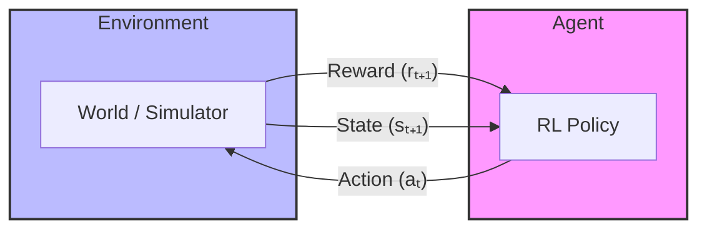

---
tags:
  - ml
  - "#rl"
  - video
created: 2026-03-13 13:25
updated: 2026-03-13 13:25
featured_image: imgs/youtube/TCCjZe0y4Qc.webp
thumbnail: imgs/resized/3cfa34daae7f952a01e1b5d02e710b7c_86cf658e.webp
---
---

---
### RL Overview

RL is more of an *active* learning process. Rather than being given optimal examples of how to perform a task, we want to learn through our *active* interactions with the environment. 

*Basic Diagram Made by Gemini*

Overarching goal is to optimize our reward using this loop between the agent and environment.  
Interesting reasons to learn through RL:
- Finding solutions
- Online learning: Arc Raiders has some really good example of this(the pops always get me)

### Rewards
Reward $R_{t}$ is how well agent is doing at time $t$. Agent wants to maximize cumulative reward into the future. $G_{t} = R_{t + 1} + R_{t + 2} + \dots$ 
This is the *return*. 

### Value
Since this return might be very complex to optimize directly, we sometimes want to optimize the value.
Given state $s$, we want to optimize $v(s) = \mathbb{E}[G_{t} | S_{t} = s]$.

There is a nice recursive definition for value: $v(s) = \mathbb{E}[R_{t+1} + v(S_{t+1}) | S_{t} = s]$. 
We use actions to maximize this value. Rewards can be delayed from the time of an action.  

### Actions
We can also condition the value on the actions $a$ that the agent takes.
$q(s, a) = \mathbb{E}[G_{t} | S_{t} = s, A_{t} = a]$

### State
Both the agent and environment may have their own state. Environment state may or may not be visible to agent. Agent state dictates predictions and policy. 

### History
This is just the set of observation, actions, and rewards for the agent. Used to construct the agent state. 

---
The observability of the environment is very important since they can change the dynamics of the probability of transitioning between different states. If it Markovian, then only our current state matters. Otherwise, our full history may be important for the transitions between states.  

Updated Agent State: $S_{t+1} = f(S_{t}, A_{t}, R_{t+1}, O_{t+1})$. Just means it is a function of what our state, action, and the results and observations. 